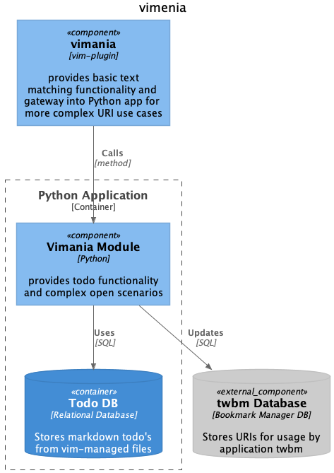

# Vimania

Vimania is a modern and extensible set of functions to be used with VIM and markdown files.

Key features:

1. Handler for arbitrary URIs in markdown files
2. Automated todo management with database backend. Todos are synchronized between markdown source file and database,
   i.e. todos can be updated direct in the DB.



## 1. Handler for URIs

It provides its versatility via a super simple user interface:

    go (go open: URL, directories, files, ...)
    goo (go open and save to URI DB, requires twbm)
    dd (delete from text and URI DB)

- open/handle HTTP links with one single mapping: `go`
- edit linked Markdown files via `go` shortcut and jump directly to relevant position (protocol: `vim::`)
- Extensibility: new protocols can be easily included, no vimscript necessary, all Python based

### Key concept:

Markdown links with custom protocol prefix:

    [uriname](protocol::specifier_text)

Examples:

    [http_url](http://www.google.com)
    [my excel file](vm::~/file/data.xlsx)
    [another markdown](vim::./relpath/story.md## Heading2)

It integrates seamless with bookmark manager [twbm](https://github.com/sysid/twbm).

### Protocols

- `vm::`: general open for handling URLs and local files/directories (via OS-specific open command)
- `vim::`: open the file in vim tab (optional: jump to anchor)

## 2. Automated Todo/Task list management

- Centralized todo list management with embedded database, keep your todo items within the context/file where they
  belong but have a centralized view on it
- no more missing, obsolete or duplicated todos
- Synchronization of todo status between Markdown files and database
- todo lists within code fences in markdown are ignored
- DB entry has a link to the task's source file, so by looking in the DB any todo can be located.
- Todos are removed from database when removed from markdown file with `dd`

### CLI interface
- `vimania` provides a CLI interface with full-text search capabilities to your todo database:

```bash
vimania -h

vimania search
```

The CLI interface is identical to the `twbm` interface, so no additional learning curve required.

### URL management: `twbm` integration

- If `twbm` is installed `Vimania` pushes URL's to the bookmark database transparently when opening the bookmark
  with `goo`.
- Pushed bookmarks have the default tag `vimania` in the bookmarks db.
- Bookmarks are removed from bookmarks database when removed from markdown file with `dd`

### Insert URIs and Todos convenience method:

I recommend configuring two [UltiSnips](https://github.com/SirVer/ultisnips) snippets:

```
snippet todo "todo for Vimania"
- [ ] ${1:todo}
endsnippet

snippet uri "link/uri for Vimania"
[${1:link}]($1)
endsnippet
```

### CLI for todo management outside of VIM
todo...


## Installation

1. Install `https://github.com/sysid/vimania` with your favourite VIM plugin manager
2. Install python dependencies (see Pipfile) into `<vimplugins>/vimania/pythonx`
3. Install CLI interface: `make install` (requires pipx)

### Dependency
[vim-textobj-uri](https://github.com/jceb/vim-textobj-uri) must be installed for URI identification

Optional:
[twbm](https://github.com/sysid/twbm) for seamless bookmark manager integration
[UltiSnips](https://github.com/SirVer/ultisnips) for easy uri and todo creation


### Configuration

Vimenia needs to know, where your Todos database is located:
`TW_VIMANIA_DB_URL="sqlite:///$HOME/vimania/todos.db"`

Optionally where your twbm database is located:
`TWBM_DB_URL="sqlite:///$HOME/twbm/todos.db"`


# Implementation Details
## URI Handler: Protocols

- `vm::`: invokes the OS specific *open* command on the following path/url
- `vim::`: call `VimaniaEdit`

The OS specific command is: `open` on MacOS, `xdg-open` on Linux and `explorer.exe` on Windows. It is not tested on
Windows though.

This protocol list can be expanded very easily, mostly via Python programming. So all the entire Python ecosystem is
available for future features.

### Examples

```
# opening files:
[filename](vm::filename.pptx)
[filename](vm::~/path/filename.docx)

[urlfoo](vm::https://url/foo)

# editing markdown and jump to heading2
[filename](vm::~/path/filename.docx## heading2)
```

## Todo Management

- Todos are recognized via the format: `- [ ] todo`
- On opening Vimania scans the markdown files and updates existing todos with the current state from the database
- On saving Vimania scans the markdown and saves new or updated todos to the database
- Vimania inserts a DB identifier ('%99%') into the markdown item in order to establish a durable link between DB and
  markdown item
- The identifier is hidden via VIM's `conceal` feature
- todo items are deleted by deleting (`dd`) in normal mode. This triggers a DB update
- todo items deleted by `dd` in visual mode are NOT delete from DB. This is useful to move tasks from one file to
  another. Otherwise, you always can move an item by just deleting it in one file and paste in to another file AND then
  remove the database id ('%99%'). So Vimania kust creates a new entry/link.

### Example todo file

After saving the file, the identifiers have been added and the items are saved in DB:

```markdown
-%1% [ ] purchase piano -%2% [ ] [AIMMS book](file:~/dev/pyomo/tutorial/AIMMS_modeling.pdf)
-%7% [ ] list repos ahead/behind remote
```

## Caveat

- Deleting markdown todo items outside Vimenia will cause inconsistency between the DB and the markdown state.
- Always use `dd` to delete a markdown item in order to trigger the corresponding DB update
- Never change the identifier '%99%' manually.
- Todo items are always synced from the DB when opening a markdown file, so changes not written back to DB will be
  lost.

Markdown content other than todo items can be changed arbitrarily, of course.

### Fixing inconsistent state

Todos in markdown can get out of sync if updates are made outside of vim, e.g. with another text editor. Don't worry,
this can be fixed easily.

#### entry already in DB

- find the corresponding id in the DB
- add the id to the markdown item: `-%99% [ ] markdown item`

### entry in DB but not in markdown

- you can safely delete the entry in the DB, unless you maintain on purpose todo items in the DB which do not have a
  counterpart in a markdown (I do).

#### Resetting everything

Deleting/adding todo items outside the control of Vimania can cause an inconsistent state between the database on the
markdown files. It is possible to re-synchronize the DB and the todo-lists by creating a new database and clearing the
todo items fo their identifier:

1. Reset DB: `cd pythonx/vimania/db; rm todos.db; alembic upgrade head`
2. Clean up existing markdown files:
    - find all affected markdown files: `rg -t md -- '-%\d+%'`
    - edit the markdown files and remove the allocated database-id to allow for
      re-init: `sed -i 's/-%[0-9]\+%/-/' todo.md`


# Development
PyCharm's source route should be `pythonx`. However, this causes problems when all dependencies are existent.
So before starting PyCharm run `make clean-vim` to clear `pythonx`.
The module will look up dependencies in the development `.venv`.

## VimaniaManager (VIM Interface)
- cannot be tested within PyCharm, needs to be called from VIM.
- activate logging and use: `/Users/Q187392/dev/vim/vimania/tests/x.md`

## Vim Plugin
for vim-plugin development do NOT clear `pythonx` because loading of python module will not work. The vim
plugin needs to find all dependencies in `pythonx`.
However, try to avoid bringing up PyCharm because it tries to index the entire dependency tree.

### Other
- `buku.py` needs to be copied from `twbm` package as it is used to push URLs to buku DB.


## Testing
- deactivate autocommand `:Vista` if active

Setup: Make sure that the working directory of test-runs is the project-root (e.g. in PyCharm)
`make test`
`make test-vim`

### VIM bridge

- For python changes it is important to restart vim after every change in order to enforce proper reload:
  this is best automated with a Vader script: `run_tests.sh testfile` in tests directory.
- vimscript changes can be reloaded as usual

### textobj/uri

- Use vim mapping `go` on the `*.vader` URIs. -- Regexp: https://regex101.com/r/LpSX0i/1

### Example

Example for registration of additional object and their handler:

```vim
" location: after/plugin/textobj_uri.vim
if ! exists('g:loaded_uri')
  echom "-W- vim-textobj-uri not availabe, please install."
  finish
endif

if g:twvim_debug | echom "-D- vim-textobj-uri is installed, registering patterns." | endif
" example pattern
URIPatternAdd! vimania://\%(\([^()]\+\)\) :silent\ !open\ "%s"
```

# TODO

todo status enum: [enum](https://stackoverflow.com/questions/5299267/how-to-create-enum-type-in-sqlite)
todos link check from DB

- resilience against external deleting
- hierarchical todos
- use yes/no interaction with vim

### Manual todo testing

reset db: `alembic upgrade head`

# vimania

# Credits

It is inspired by and recommends to use [UltiSnips](https://github.com/SirVer/ultisnips).
